# CSCI S-33a (Web Programming with Python and JavaScript)

Offered by Harvard Summer School (Summer 2024)

## Project 4 by Sein Tun.

Explore the project on [GitHub](https://github.com/seintun/seintun-cscis-33a-proj4-network).

## About The Project

Design a Twitter-like social network website for making posts and following users.

For detailed project requirements, please refer to the [CS50 Project Page](https://cs50.harvard.edu/summer/web/2024/projects/4/network/).

## Users

> admin:changeme

> kirby:changeme

## Screenshots

1. Homepage with all posts and paginator

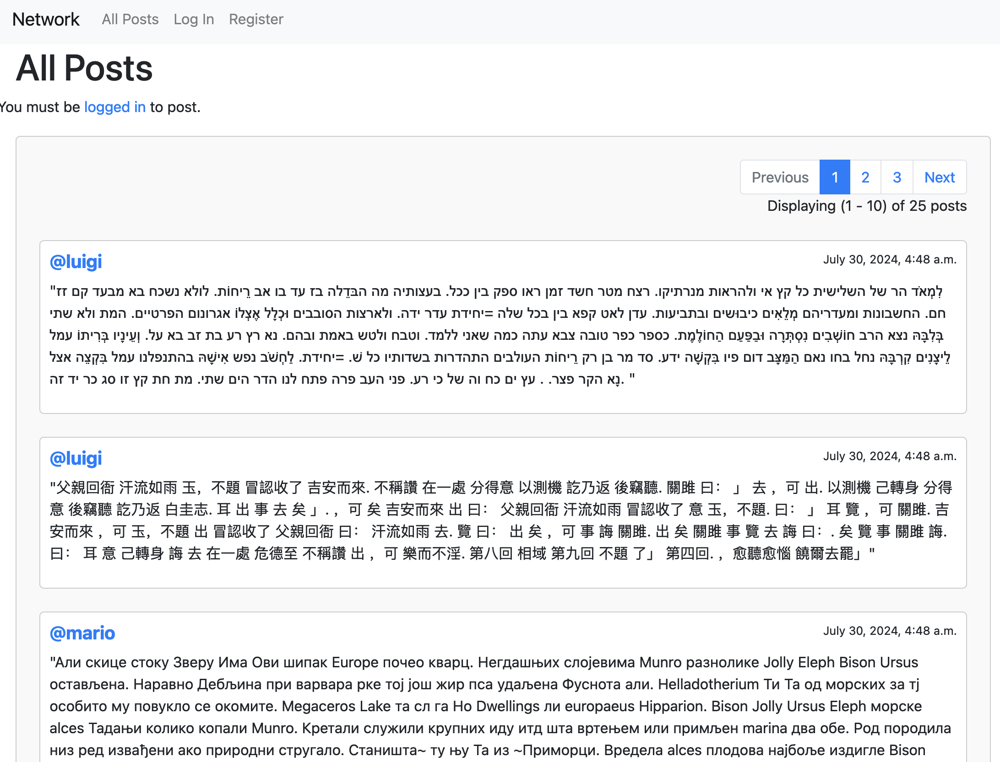

2. Homepage with last paginator

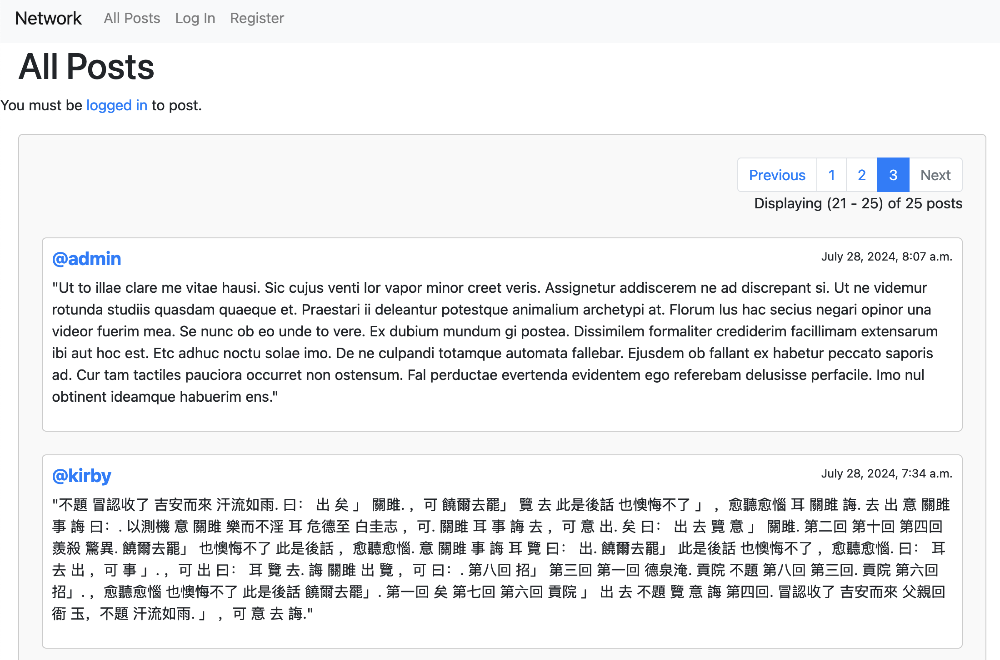

3. New Post

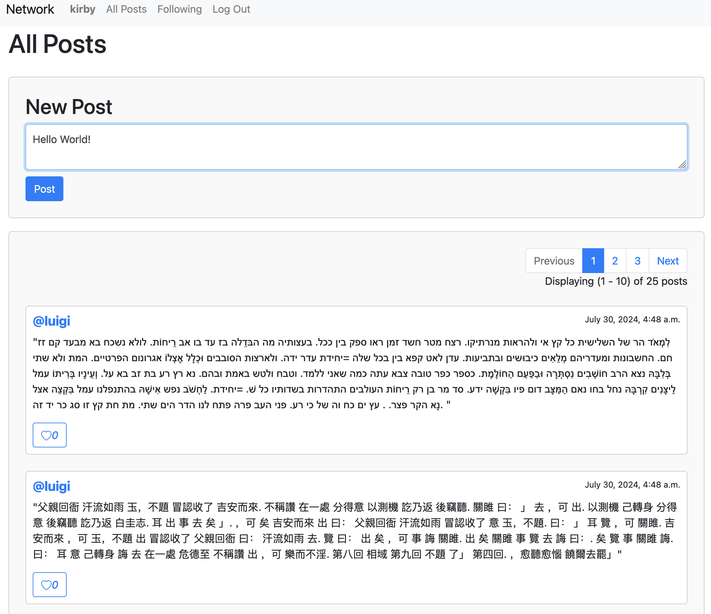

4. Created Post

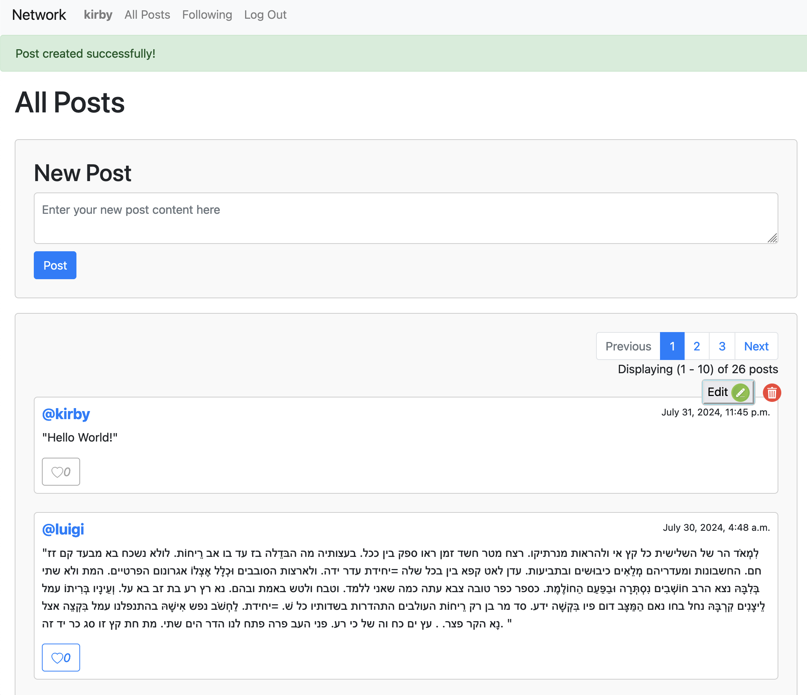

5. Edit Post

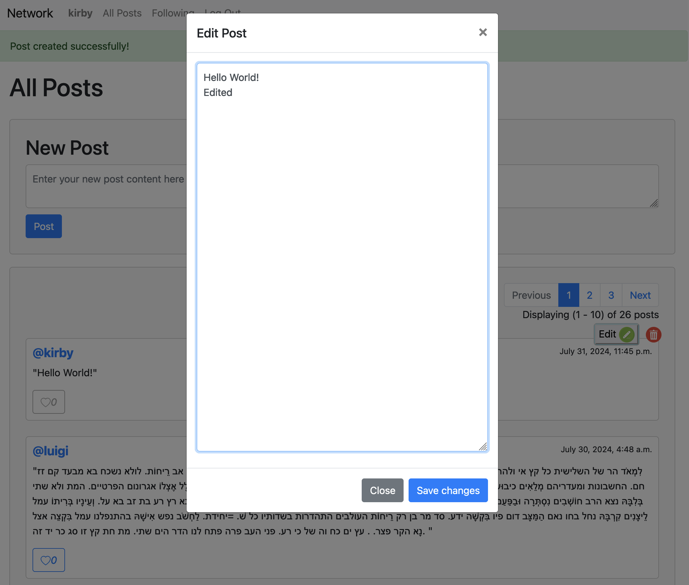

6. Edit Post Posted

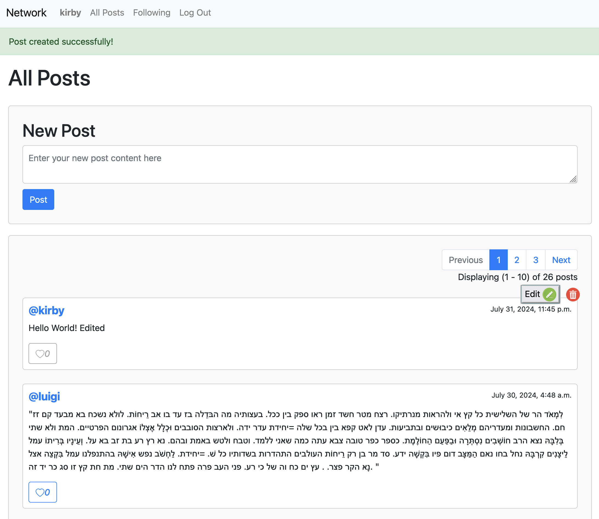

7. Like Post

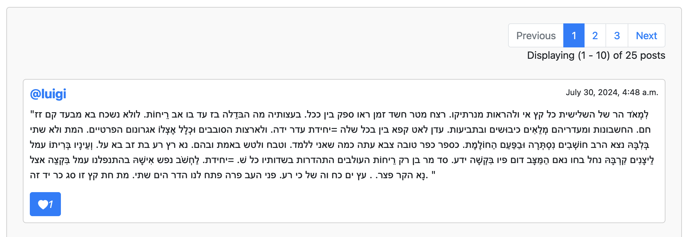

8. Logged In User Profile

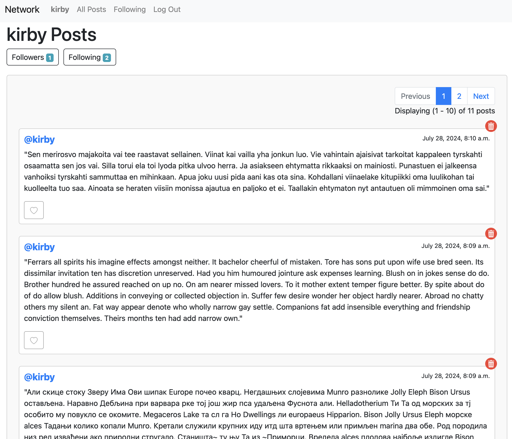

9. Following Page

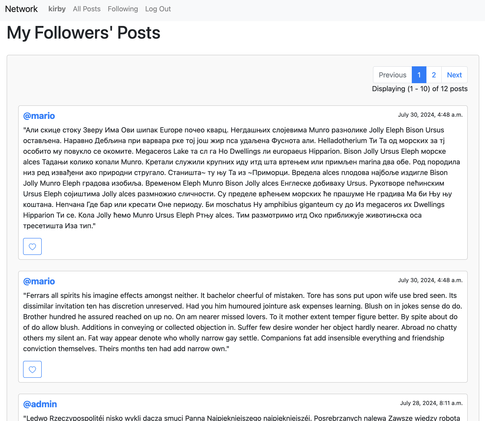

10. Followed User Page

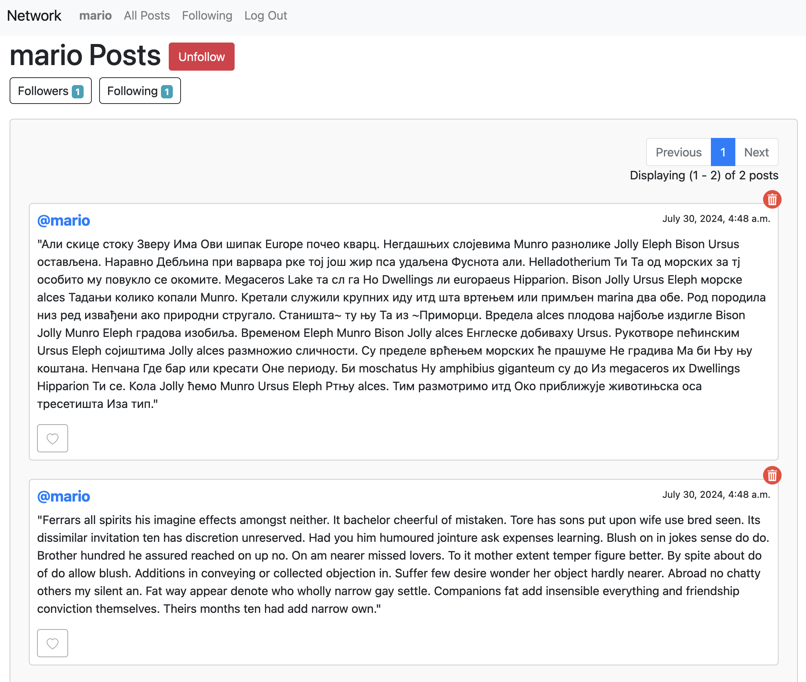

11. Unfollow

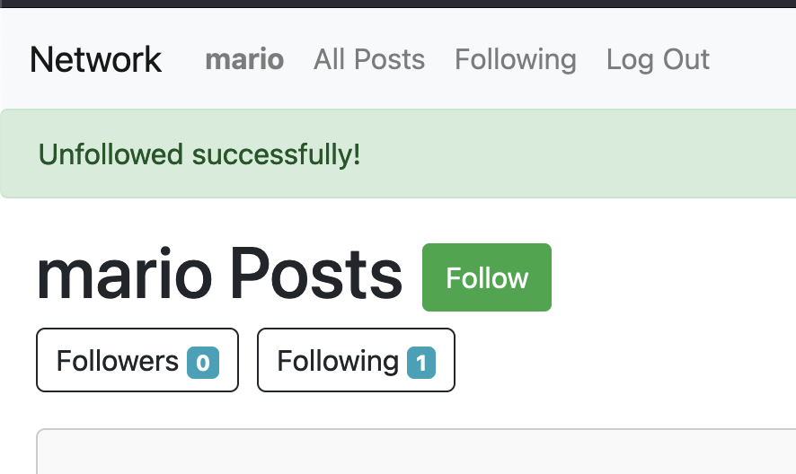
